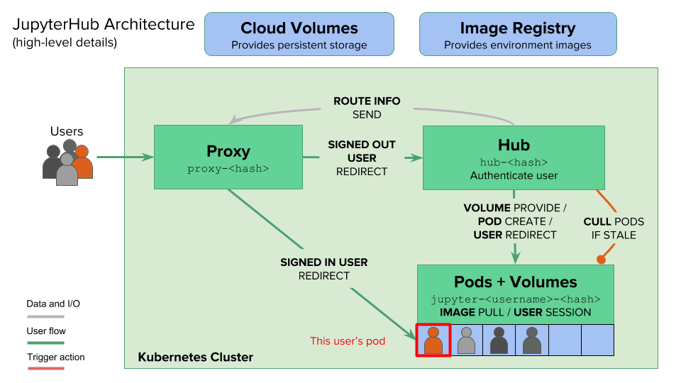

# Zero to JupyterHub with Kubernetes

## The JupyterHub Architecture

The JupyterHub Helm Chart manages resources in the cloud using Kubernetes. There are several moving pieces that, together, handle authenticating users, pulling a Docker image specified by the administrator, generating the user pods in which users will work, and connecting users with those pods.

The following diagram gives a high-level overview of the many pieces of JupyterHub, and how they fit together in this process:



The JupyterHub platform has three essential components—hub, proxy, and single-user Notebook server. The hub is the heart of the platform that orchestrates the lifecycle of a Notebook. The proxy acts as the front-end to route requests to the hub, which is exposed to the outside world through an HTTP load balancer or in Kubernetes, an ingress controller. When a user logs into the platform, the hub provisions a single-user Notebook instance for them. Each user gets a dedicated instance of the Notebook that’s completely isolated from the other users. In Kubernetes, the instance is mapped to a pod.

After a specific period of inactivity, the hub automatically culls the pod associated with the inactive user. When the same user logs in again, the hub schedules a pod that contains the state persisted during the previous session. 

Behind the scenes, JupyterHub creates a persistent volume claim (PVC) and a persistent volume for each user. Even though the pod gets deleted as part of the culling process, the PV is retained, which gets attached to the new pod when an existing user logs in. 

## Installing JupyterHub

```
helm repo add jupyterhub https://jupyterhub.github.io/helm-chart/
helm repo update

helm search repo jupyterhub ## list available char

## download value files to local
helm show values jupyterhub/jupyterhub > C:\Larry\study\python\workspace\pythonBasic\helm\jupyterhub\values.yaml
```

helm install jupyterhub1 jupyterhub/jupyterhub --namespace jupyterhub --values C:\Larry\study\python\workspace\pythonBasic\helm\jupyterhub\values.yaml


## Reference
[https://z2jh.jupyter.org/en/stable/administrator/index.html](https://z2jh.jupyter.org/en/stable/administrator/index.html)

[https://z2jh.jupyter.org/en/stable/](https://z2jh.jupyter.org/en/stable/)

